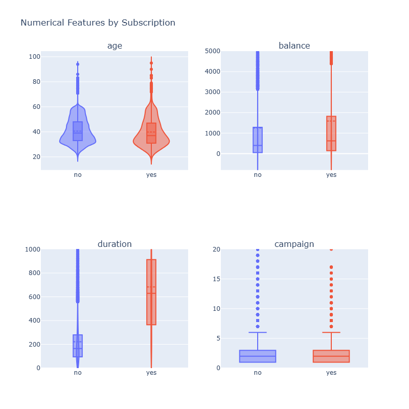
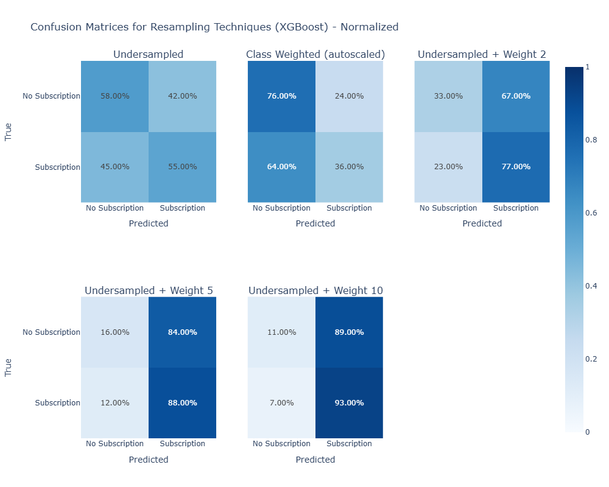
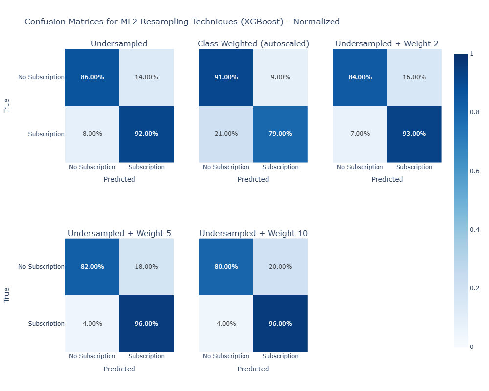
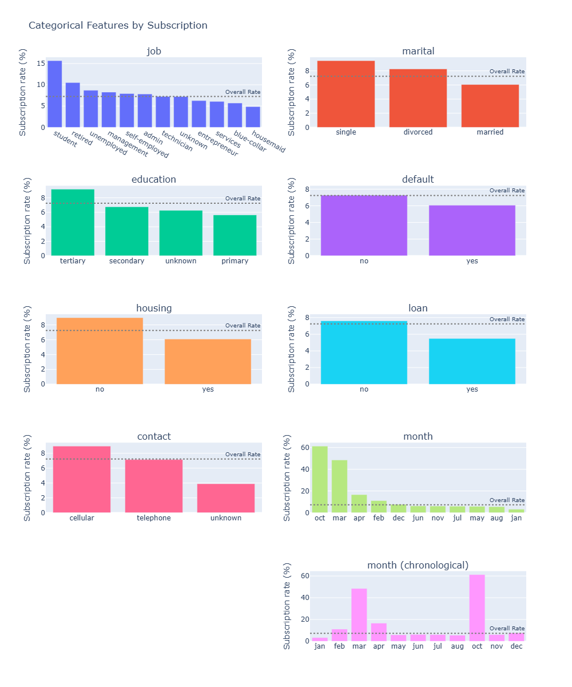
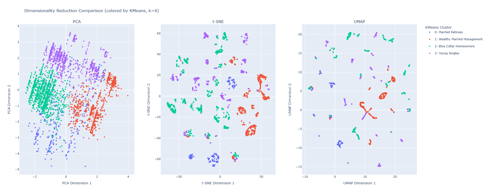
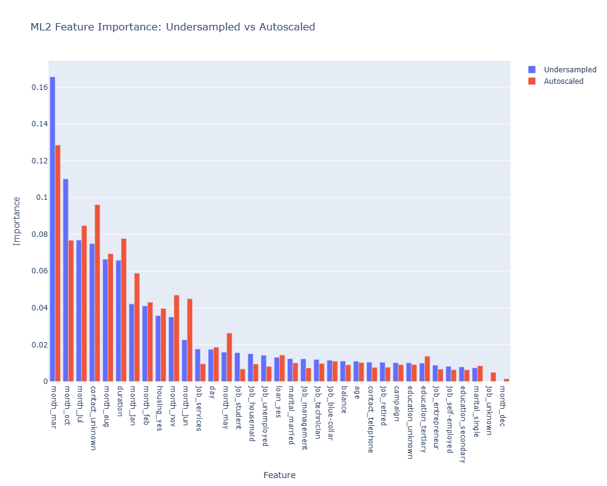

  

# Predicting Term Deposit Subscriptions for a European Bank

## About This Project

A European banking institution runs phone call marketing campaigns to sell term deposits. With only ~7% of customers subscribing, the vast majority of calls are wasted. We built a two layer ML system and a customer segmentation analysis to reduce wasted effort and help agents prioritize high probability customers.

### The Problem

Out of 40,000 customers contacted, only ~2,900 subscribed (~7%). Every unsuccessful call costs agent time and company resources. The bank needs to know:
- **Who to call** before making any calls
- **Who to keep calling** during the campaign

[View the Marimo Notebook here](https://marimo.app/github/macsiwase/fintech-term-deposit-marketing/blob/main/termDeposit.py)

[Find the CSV data here](https://drive.google.com/file/d/1lWpmJAXMGlKJAwyT81gD0kWyannhIQPs/view?usp=sharing)

## Results

### Two Layer ML System

Built a two layer ML system that saves ~13,000 unnecessary sales calls while catching 91% of potential subscribers.

| Layer | Purpose | Model | Recall | Accuracy |
|-------|---------|-------|--------|----------|
| ML1 (Pre call filter) | Reduce call list before any calls | XGBoost + undersampling + weight 2 | ~76% | 36% (optimized for recall) |
| ML2 (Call optimizer) | Prioritize who to keep calling | XGBoost + undersampling | ~91% | ~86% |
| Customer Segmentation | Identify actionable customer archetypes | KMeans (k=4) validated with hierarchical clustering | n/a | n/a |

ML1 optimizes for recall (catching subscribers) rather than accuracy, since accuracy is misleading with a large class imbalance.

ML2 exceeds the project's 81% accuracy target with 5-fold cross validation.

Customer segmentation identifies four actionable archetypes for campaign targeting.

### ML1: Pre Call Filter

ML1 uses only pre call features (age, job, education, balance, etc.) to filter the call list before any calls are made.

  

- Reduces the call list from 40,000 to ~27,000 (~32% reduction)
- Catches ~76% of potential subscribers before any calls are made
- Saves ~13,000 unnecessary calls

### ML2: Call Optimizer

ML2 uses all features including post call data (duration, campaign, month, contact) to help agents decide which customers to keep calling.

  

- Catches ~91% of subscribers with ~86% accuracy
- Validated with 5-fold CV (std +/-0.97%)
- As class weight increases, recall improves at the cost of more false positives

### Segments to Prioritize

  

| Segment | Conversion Rate |
|---------|----------------|
| Students | 15.6% |
| Retirees | 10.5% |
| Single | 9.4% |
| Tertiary education | 9.2% |
| No housing loan | 9.0% |

Management is the highest volume high-conversion segment.

### Customer Segmentation

Used KMeans clustering (k=4) on subscribers to identify actionable customer segments, validated with hierarchical clustering and visualized with PCA, t-SNE, and UMAP.

**Four Customer Segments:**

| Segment | Profile | Size |
|---------|---------|------|
| Blue Collar Homeowners | Married, secondary education, has housing loan | ~1,091 |
| Wealthy Married Management | Tertiary education, high balance, no debt | ~754 |
| Young Singles | Single, secondary education | ~736 |
| Married Retirees | Older, no housing loan, high balance | ~315 |

  

- **Caveat on clustering**: Silhouette scores peaked at only ~0.29 (well below the 0.5 "well separated" threshold). Segments are directional guides for campaign targeting rather than statistically perfect groupings.
- **Dimensionality reduction** (t-SNE, UMAP) revealed finer subclusters, suggesting customer profiles are more granular than 4 segments but 4 segments strikes a pragmatic balance for marketing campaign allocation.

### Key Features Driving Subscriptions

  

- **Timing matters most**: March and October had the highest conversion rates and dominated ML2's feature importance
- Pre call demographic features contribute roughly equally with no single dominant predictor (explaining ML1's lower performance)

## My Approach

### Focus on Recall Over Accuracy

With 93% of customers not subscribing, a model predicting "no" for everyone achieves 93% accuracy while being completely useless. I shifted focus to **recall** (catching actual subscribers) because missing a potential subscriber costs more than a wasted call.

### Methodology

1. **Exploratory Data Analysis**: Univariate distributions (histograms, skewness, kurtosis), bivariate analysis (subscription rates by segment, violin plots), and correlation analysis (Pearson and Spearman) to understand feature relationships.

2. **ML1 (Pre-call filter)**: Tested Random Forest with multiple resampling strategies (undersampling, SMOTE-Tomek, SMOTE-ENN, class weights). Undersampling was the only effective strategy. Switched to XGBoost with `scale_pos_weight` tuning, achieving ~76% recall.

3. **ML2 (Call optimizer)**: Used all features including post call data. XGBoost with undersampling achieved ~91% recall, validated with 5-fold CV (std +/-0.97%).

4. **Feature importance analysis**: Identified March and October as dominant predictors in ML2. Verified month features carry real signal by training without them (recall drops from 92% to 85%).

5. **Customer segmentation**: Clustered subscribers into 4 segments using KMeans (k=4), validated with hierarchical clustering via dendrogram and Adjusted Rand Index (ARI = 0.413). Compared PCA, t-SNE, and UMAP to visualize segment structure. The data lacks clean natural clusters (silhouette < 0.3), so segments are directional guides for targeting rather than statistically separated groups.

## Recommendations

| Action | Impact |
|--------|--------|
| **Deploy ML1** to filter the call list before campaigns | Save ~13,000 unnecessary calls |
| **Use ML2** during campaigns to guide follow-up decisions | Catch ~91% of subscribers |
| **Focus campaigns on March and October** | Highest conversion months |
| **Prioritize management, students, and retirees** | Highest conversion segments |

## Technical Summary

- **Models**: XGBoost (both ML layers), KMeans, Hierarchical Clustering (Ward linkage)
- **Dimensionality reduction**: PCA, t-SNE, UMAP
- **Imbalance handling**: Random undersampling + scale_pos_weight tuning
- **Validation**: 5-fold stratified cross validation for ML. Silhouette score and Adjusted Rand Index for clustering
- **Key metrics**: ML1 ~76% recall, ML2 ~91% recall with ~86% accuracy, clustering ARI = 0.413
- **Dataset**: 40,000 customer records from a European banking marketing campaign
- **Stack**: Python, Polars, Plotly, scikit-learn, XGBoost, imbalanced-learn, umap-learn, Marimo

